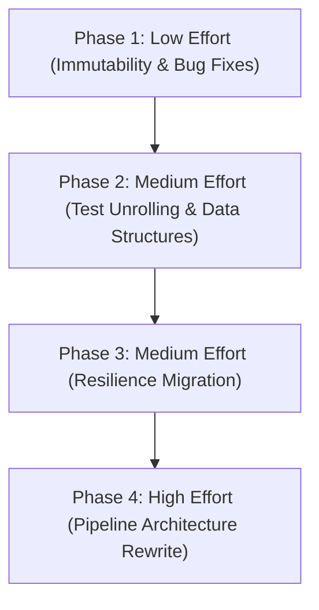

# Modernization & Modularization Plan

## Phased Execution Strategy

We have divided the refactoring into four distinct phases based on effort and risk, culminating in the highest-effort architectural rewrites.

## Phase 1 — Low Effort (Immutability & Bug Fixes)
> **Goal:** Address all quick-wins identified across the domains. Safe, isolated changes.
- **Services:** `ApplicationService` Immutability Update (return `IReadOnlyList<Mod>`), `ModMatchingService` Consolidate Matching Logic.
- **Models:** Add `sealed` to `CheckModsExtendedJsonSerializerContext`, Cache Statics in `IgnoredUpdateOptions`, make `PendingConfirmation` an immutable record.
- **Infrastructure:** Fix JSON Options bug in `IgnoreReportUrl`, Consolidate Assembly reflection in `ServiceCollectionExtensions`, harden `SuffixesToRemove` in `ModNameNormalizer`.
- **Tests:** Normalize Project Structure (relocate fakes/fixtures), Strict Naming Rules.

## Phase 2 — Medium Effort (Data Structures & Test Unrolling)
> **Goal:** Address structural inconsistencies in models and strictly enforce `AGENTS.md` testing rules.
- **Models:** Unify DTOs (`SptVersionResponse`), update `DependencyChange` collections to `IReadOnlyList`, pre-compute `MisplacedModReport` expensive getters.
- **Tests:** Unroll all `[Theory]` methods into `[Fact]`, consolidate Entity Factories (`ModFixture`), backfill missing coverage.
- **Services:** Simplify `ModReconciliationService` reconciliation loop with LINQ.

## Phase 3 — Medium Effort (Resilience Migration)
> **Goal:** Drop custom `RateLimitService` in favor of standard .NET native HTTP resilience.
> 
> **Why do this?** Polling and semaphores in custom rate limiters are notorious for introducing hard-to-reproduce thread-starvation or deadlock bugs. The native .NET `Microsoft.Extensions.Http.Resilience` package uses highly optimized, battle-tested Polly v8 engines. It ensures we don't accidentally DDOS an upstream service or lock our own threads.
> 
> **Is it easy / what is the blast radius?** Yes, it is very easy. The change is isolated purely to `Program.cs` / DI registration (adding `.AddStandardResilienceHandler()` to our `HttpClient`) and deleting the `RateLimitService.cs` class. The blast radius is completely contained to the HTTP pipeline; no business logic is affected. Standard Serilog logging will automatically capture retry attempts, so no custom telemetry migration is necessary.

## Phase 4 — High Effort (Pipeline Architecture & Domain Separation)
> **Goal:** Dismantle the massive 14-dependency `ApplicationService` God Object into a clean, testable 13-step `IWorkflowStep` pipeline pattern, utilizing `Parallel.ForEachAsync` for concurrency, while structurally separating massive domain files.

To mitigate regression risks, this phase is systematically broken down into bite-sized, testable sub-phases:

### Phase 4.1: Domain Models Split (Zero-Risk Refactoring)
- **Goal:** Deconstruct the massive `ApiResponses.cs` file into individual, focused records (e.g., `SptVersionResponse.cs`, `ForgeModSearchResponse.cs`).
- **Validation:** Purely a structural file shift. Run `dotnet build` to ensure namespaces remain intact. No business logic is altered.

### Phase 4.2: Pipeline Skeleton & Interfaces (Zero-Impact Additive)
- **Goal:** Define the `WorkflowContext` data bag (which will hold state as it passes through the pipeline) and the `IWorkflowStep` interface contract in a dedicated `Pipeline/` folder.
- **Validation:** Purely additive. Ensures the target architectural shape compiles perfectly before any legacy code is touched.

### Phase 4.3: Integration Test Fortification (Safety Net)
- **Goal:** Audit and shore up `ApplicationServiceTests.cs` to ensure 100% end-to-end integration coverage for all outcomes (Success, API Failure, User Cancellation, Missing Dependencies).
- **Validation:** Provides the ultimate safety net. If we change the structure but keep the behavior identical, these tests will prevent any behavioral drift during the teardown.

### Phase 4.4: Step Migration & Service Teardown (High Effort)
- **Goal:** Inside an isolated `git worktree`, systematically strip the logic out of `ApplicationService.cs` and migrate it into discrete, single-responsibility pipeline steps (e.g., `ScanLocalModsStep`, `FetchRemoteUpdatesStep`, `ReconciliationStep`).
- **Validation:** Each individual step can now be unit tested in isolation. The fortified integration tests from 4.3 must continue to pass seamlessly.

### Phase 4.5: Dependency Injection & Cleanup (Final Swap)
- **Goal:** Wire the new pipeline steps together via an orchestrator (or standard DI) in `ServiceCollectionExtensions.cs`. Delete the legacy `ApplicationService.cs` entirely, permanently ripping out its 14 constructor dependencies.
- **Validation:** Final `dotnet test CheckModsExtended.slnx` and `dotnet run` verification.
