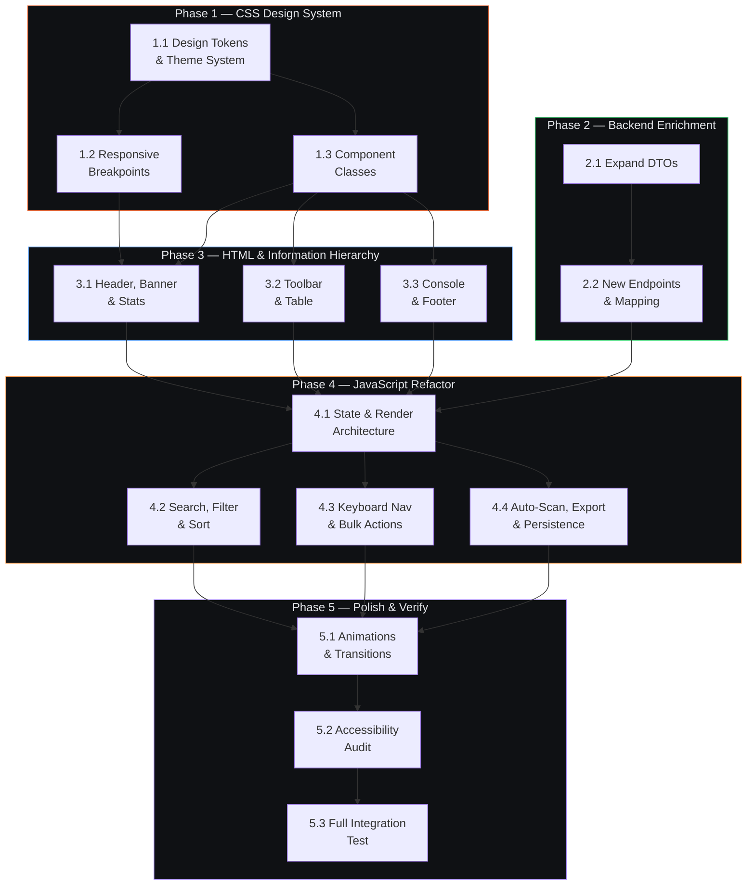

# Web UI Redesign — Architecture Plan

> Phased execution plan for the Check Mods Extended web UI redesign.
> Each step is scoped for a single git-worktree subagent, independently testable, and mergeable.

---

## Design Decisions (Resolved)

| Decision | Resolution |
|----------|-----------|
| Font change | Replace Rajdhani (body) with Inter. Keep Rajdhani for brand title only. |
| Framework | Stay vanilla HTML/CSS/JS. No build step. |
| Auto-scan | Yes — auto-scan on page load. Future: skeleton cache of last-known state. |
| Theme toggle | Yes — implement light/dark toggle with tokenized theme system. |
| Export | Yes — "Copy as Markdown" showing mods, types, dependencies, paired status. |

---

## Phase Dependency Graph



**Parallelism opportunities:**
- Phase 1 and Phase 2 run **fully in parallel** (CSS has no dependency on backend)
- Steps 1.2 and 1.3 run **in parallel** after 1.1
- Steps 4.2, 4.3, and 4.4 run **in parallel** after 4.1
- Steps 5.1 and 5.2 can overlap

---

## Phase 1 — CSS Design System & Responsive Foundation

> **Goal**: Replace the flat CSS with a tokenized, themeable, responsive design system.
> **Files**: `wwwroot/css/style.css` (rewrite)
> **Parallel with**: Phase 2 (backend)

---

### Step 1.1 — Design Tokens & Theme System

**Agent**: Worktree `ui/step-1.1-tokens`
**File**: `wwwroot/css/style.css`

**What to do:**
1. Replace the existing 8 CSS custom properties (lines 1–17) with a complete semantic token system
2. Create `[data-theme="dark"]` (default) and `[data-theme="light"]` token overrides
3. Replace ALL hardcoded color values throughout the file (`#5bc0de`, `rgba(...)`, `#ff6b6b`, `#ffa94d`, `#8ce99a`) with semantic tokens
4. Update the Google Fonts import to include `Inter` (`family=Inter:wght@400;500;600;700`)
5. Set `--font-ui: 'Inter', system-ui, sans-serif` as the body font, keep `--font-brand: 'Rajdhani'` for the title only
6. Add `@media (prefers-reduced-motion: reduce)` ruleset
7. Add `@media (prefers-color-scheme: light)` for auto-detection

**Dark tokens:**
```css
[data-theme="dark"] {
  --bg-base:     #0F1114;
  --bg-surface:  #1A1D21;
  --bg-elevated: #242830;
  --bg-overlay:  #2E333B;
  --text-primary:   #E5E7EB;
  --text-secondary: #9CA3AF;
  --text-muted:     #6B7280;
  --accent-brand:       #E46231;
  --accent-brand-hover: #F0764A;
  --status-success:    #4ADE80;
  --status-warning:    #FB923C;
  --status-error:      #F87171;
  --status-info:       #60A5FA;
  --status-neutral:    #9CA3AF;
  --status-success-bg: rgba(74, 222, 128, 0.08);
  --status-warning-bg: rgba(251, 146, 60, 0.08);
  --status-error-bg:   rgba(248, 113, 113, 0.08);
  --status-info-bg:    rgba(96, 165, 250, 0.08);
  --border-subtle:  #1E2228;
  --border-default: #2E333B;
  --border-strong:  #374151;
}
```

**Light tokens:**
```css
[data-theme="light"] {
  --bg-base:     #F8F9FA;
  --bg-surface:  #FFFFFF;
  --bg-elevated: #F1F3F5;
  --bg-overlay:  #E9ECEF;
  --text-primary:   #1A1D21;
  --text-secondary: #495057;
  --text-muted:     #868E96;
  --accent-brand:       #D4531E;
  --accent-brand-hover: #C2451A;
  --status-success:    #16A34A;
  --status-warning:    #D97706;
  --status-error:      #DC2626;
  --status-info:       #2563EB;
  --status-neutral:    #6B7280;
  --status-success-bg: rgba(22, 163, 74, 0.08);
  --status-warning-bg: rgba(217, 119, 6, 0.08);
  --status-error-bg:   rgba(220, 38, 38, 0.08);
  --status-info-bg:    rgba(37, 99, 235, 0.08);
  --border-subtle:  #E9ECEF;
  --border-default: #DEE2E6;
  --border-strong:  #CED4DA;
}
```

**Shared tokens (theme-independent):**
```css
:root {
  --space-xs: 4px;  --space-sm: 8px;  --space-md: 16px;
  --space-lg: 24px; --space-xl: 32px; --space-2xl: 48px;
  --radius-sm: 4px; --radius-md: 6px; --radius-lg: 8px; --radius-full: 999px;
  --font-ui:    'Inter', system-ui, -apple-system, sans-serif;
  --font-mono:  'JetBrains Mono', 'Cascadia Code', monospace;
  --font-brand: 'Rajdhani', 'Chakra Petch', sans-serif;
  --transition-fast: 100ms ease;
  --transition-normal: 200ms ease;
}
```

**Acceptance criteria:**
- [x] Zero hardcoded color values remain (except inside `:root` / `[data-theme]`)
- [x] `document.documentElement.dataset.theme = 'light'` switches the entire UI
- [x] `@media (prefers-reduced-motion: reduce)` disables all animations
- [x] Body text uses Inter, title uses Rajdhani
- [x] `dotnet build CheckMods.slnx` passes (no backend changes)

---

### Step 1.2 — Responsive Breakpoints

**Agent**: Worktree `ui/step-1.2-responsive`
**Depends on**: Step 1.1
**File**: `wwwroot/css/style.css`

**What to do:**
1. Remove `overflow: hidden` from `body` (line 34)
2. Replace `height: 100vh` on `.terminal-container` with `min-height: 100vh`
3. Add three responsive breakpoints at the END of the CSS file:

```css
/* ───── Tablet ≤1024px ───── */
@media (max-width: 1024px) {
  .app-header { flex-direction: column; align-items: flex-start; gap: var(--space-sm); padding: var(--space-md); }
  .header-controls { width: 100%; display: flex; gap: var(--space-sm); }
  .col-author { display: none; }
  .stats-panel { flex-wrap: wrap; }
  .dashboard { padding: var(--space-md); }
}

/* ───── Mobile ≤768px ───── */
@media (max-width: 768px) {
  .mod-table thead { display: none; }
  .mod-table tbody tr:not(.details-row) {
    display: grid;
    grid-template-columns: auto 1fr auto;
    grid-template-rows: auto auto auto;
    gap: var(--space-xs) var(--space-sm);
    padding: var(--space-md);
    border: 1px solid var(--border-default);
    border-radius: var(--radius-md);
    margin-bottom: var(--space-sm);
  }
  .mod-table td::before {
    content: attr(data-label);
    font-size: 0.7rem; color: var(--text-secondary);
    text-transform: uppercase; letter-spacing: 0.5px; display: block;
  }
  button, .btn-secondary { min-height: 44px; min-width: 44px; padding: var(--space-sm) var(--space-md); }
  .console-drawer.collapsed { height: 36px; overflow: hidden; }
  .console-drawer.collapsed .console-body { display: none; }
  .stats-panel { gap: var(--space-sm); }
  .stat-box { flex: 1 1 45%; }
}

/* ───── Small Mobile ≤480px ───── */
@media (max-width: 480px) {
  .stat-box { flex: 1 1 100%; }
  .header-controls { flex-direction: column; }
  .filter-chips { flex-wrap: wrap; }
}
```

**Acceptance criteria:**
- [x] At 1024px: header stacks, author column hides, stats wrap
- [x] At 768px: table rows become cards with data-label fields, buttons are ≥44px touch targets
- [x] At 480px: stats stack single-column
- [x] No horizontal overflow at any breakpoint
- [x] Console is collapsible on mobile

---

### Step 1.3 — Component CSS Classes

**Agent**: Worktree `ui/step-1.3-components`
**Depends on**: Step 1.1
**File**: `wwwroot/css/style.css`

**What to do:**
Add CSS classes for new UI components. These are purely additive — no existing classes are modified.

1. **Status pills** (replace color-only `.status-block`):
```css
.status-pill {
  display: inline-flex; align-items: center; gap: var(--space-xs);
  padding: 2px 10px; border-radius: var(--radius-full);
  font-family: var(--font-mono); font-size: 0.7rem;
  font-weight: 600; letter-spacing: 0.5px; text-transform: uppercase;
  white-space: nowrap;
}
.status-pill-ok       { color: var(--status-success); background: var(--status-success-bg); }
.status-pill-update   { color: var(--status-warning); background: var(--status-warning-bg); }
.status-pill-blocked  { color: var(--status-error);   background: var(--status-error-bg); }
.status-pill-incompat { color: var(--status-error);   background: var(--status-error-bg); }
.status-pill-newer    { color: var(--status-info);    background: var(--status-info-bg); }
.status-pill-unknown  { color: var(--status-neutral); background: rgba(156,163,175,0.08); }
```

2. **Health banner**:
```css
.health-banner {
  padding: var(--space-md) var(--space-lg);
  font-family: var(--font-mono); font-size: 0.9rem;
  border-bottom: 1px solid var(--border-default); text-align: center;
}
.health-banner-ok   { background: var(--status-success-bg); color: var(--status-success); }
.health-banner-warn { background: var(--status-warning-bg); color: var(--status-warning); }
```

3. **Search & Filter chips toolbar**:
```css
.toolbar { display: flex; flex-wrap: wrap; gap: var(--space-sm); padding: var(--space-md); align-items: center; }
.search-wrapper { position: relative; flex: 1; min-width: 200px; }
.search-input {
  width: 100%; padding: var(--space-sm) var(--space-md); padding-left: 36px;
  background: var(--bg-surface); border: 1px solid var(--border-default);
  border-radius: var(--radius-md); color: var(--text-primary);
  font-family: var(--font-ui); font-size: 0.875rem;
}
.search-input:focus { border-color: var(--accent-brand); outline: none; box-shadow: 0 0 0 2px rgba(228,98,49,0.2); }
.search-icon { position: absolute; left: 10px; top: 50%; transform: translateY(-50%); color: var(--text-muted); pointer-events: none; }
.search-count { position: absolute; right: 10px; top: 50%; transform: translateY(-50%); color: var(--text-muted); font-size: 0.75rem; font-family: var(--font-mono); }

.filter-chips { display: flex; gap: var(--space-xs); flex-wrap: wrap; }
.chip {
  padding: 4px 12px; border-radius: var(--radius-full);
  border: 1px solid var(--border-default); background: transparent;
  color: var(--text-secondary); font-family: var(--font-ui);
  font-size: 0.8rem; cursor: pointer; transition: all var(--transition-fast); white-space: nowrap;
}
.chip:hover { border-color: var(--text-secondary); }
.chip.active { background: var(--accent-brand); color: white; border-color: var(--accent-brand); }
.chip-count { font-family: var(--font-mono); font-size: 0.7rem; margin-left: 4px; opacity: 0.7; }
```

4. **Sortable column headers**:
```css
th[data-sortable] { cursor: pointer; user-select: none; }
th[data-sortable]:hover { color: var(--text-primary); }
th[data-sortable]::after { content: ''; margin-left: 4px; font-size: 10px; }
th[aria-sort="ascending"]::after { content: ' ▲'; }
th[aria-sort="descending"]::after { content: ' ▼'; }
```

5. **Sticky thead**: `thead th { position: sticky; top: 0; z-index: 10; }`

6. **Version display variants**:
```css
.version-match   { color: var(--text-muted); }
.version-outdated { color: var(--status-warning); font-weight: 600; }
.version-newer   { color: var(--status-info); font-weight: 600; }
.version-arrow   { margin: 0 var(--space-xs); opacity: 0.6; }
.col-version { font-variant-numeric: tabular-nums; }
```

7. **Bulk action bar**:
```css
.bulk-bar {
  position: sticky; bottom: 0; z-index: 20;
  display: flex; align-items: center; gap: var(--space-md);
  padding: var(--space-sm) var(--space-lg);
  background: var(--bg-overlay); border-top: 1px solid var(--border-strong);
  backdrop-filter: blur(8px);
}
.bulk-bar[hidden] { display: none; }
```

8. **Theme toggle, Row selection, Console controls**:
```css
.theme-toggle { background: none; border: 1px solid var(--border-default); border-radius: var(--radius-md); padding: var(--space-xs) var(--space-sm); color: var(--text-secondary); cursor: pointer; }
.theme-toggle:hover { border-color: var(--text-primary); color: var(--text-primary); }
tr.selected { background: rgba(228, 98, 49, 0.04); }
tr.keyboard-focus { outline: 2px solid var(--accent-brand); outline-offset: -2px; }
.row-checkbox { width: 16px; height: 16px; accent-color: var(--accent-brand); cursor: pointer; }
.console-toggle { background: none; border: none; color: var(--text-muted); cursor: pointer; padding: var(--space-xs); }
.console-copy-btn { background: none; border: 1px solid var(--border-default); color: var(--text-muted); cursor: pointer; font-size: 11px; padding: 2px 8px; border-radius: var(--radius-sm); font-family: var(--font-mono); }
```

**Acceptance criteria:**
- [x] All component classes are purely additive (no existing selector breakage)
- [x] Each component class uses only semantic tokens (no hardcoded colors)
- [x] Components render correctly in both dark and light themes
- [x] `dotnet build CheckMods.slnx` passes

---

### Phase 1 Audit Checkpoint

```bash
dotnet build CheckMods.slnx
dotnet test CheckMods.slnx
```
- Visually verify: Open in browser, switch theme via DevTools (`document.documentElement.dataset.theme = 'light'`)
- Verify: No hardcoded colors remain outside `:root` / `[data-theme]`
- Verify: Resize browser to 1024px, 768px, 480px — no horizontal overflow
- Verify: Existing table layout is not broken (new classes are additive only)

---

## Phase 2 — Backend Data Enrichment

> **Goal**: Expose unused-but-available data to the web UI.
> **Files**: `Services/Web/WebDto.cs`, `Services/Web/WebEndpoints.cs`
> **Parallel with**: Phase 1 (CSS) — completely independent

---

### Step 2.1 — Expand DTOs

**Agent**: Worktree `ui/step-2.1-dtos`
**File**: `Services/Web/WebDto.cs`

**What to do:**

1. Add fields to `StatusResponse`:
```csharp
public record StatusResponse(
    string Status,
    string Version,
    string? SptVersion,
    string? LatestAppVersion,
    bool AppUpdateAvailable
);
```

2. Add fields to `ModDto`:
```csharp
public record ModDto(
    // ... existing fields ...
    string? SourceCodeUrl = null,
    string? LocalSptVersion = null,
    bool HasWarnings = false,
    IReadOnlyList<string>? LoadWarnings = null,
    bool IsIgnored = false,
    bool IsPaired = false
);
```

3. Add `MisplacedModDto` and `CrossInstalledDirectoryDto`:
```csharp
public record MisplacedModDto(string Name, string Version, string FilePath, bool IsServerMod);

public record CrossInstalledDirectoryDto(
    string Directory,
    IReadOnlyList<MisplacedModDto> Mods,
    bool Ambiguous
);

public record MisplacedModReportDto(
    IReadOnlyList<MisplacedModDto> WrongFolder,
    IReadOnlyList<CrossInstalledDirectoryDto> CrossInstalled
);
```

4. Expand `ScanResponse`:
```csharp
public record ScanResponse(
    List<ModDto> Mods,
    MisplacedModReportDto? MisplacedMods,
    string? SptVersion
);
```

5. Add `ExportModDto` for the export feature:
```csharp
public record ExportModDto(
    string Name,
    string Author,
    string LocalVersion,
    string? LatestVersion,
    string Status,
    string Type,
    bool IsPaired,
    IReadOnlyList<string>? Dependencies
);
```

6. Add to `CheckModsExtendedJsonSerializerContext` all new types so Native AOT can serialize them.

**Acceptance criteria:**
- [ ] `dotnet build CheckMods.slnx` passes
- [ ] `dotnet test CheckMods.slnx` passes (existing tests still pass — DTO changes are additive)
- [ ] New DTO records follow project conventions (positional records, XML docs)

---

### Step 2.2 — New Endpoints & Mapping

**Agent**: Worktree `ui/step-2.2-endpoints`
**Depends on**: Step 2.1
**File**: `Services/Web/WebEndpoints.cs`

**What to do:**

1. **Enrich `/api/status`** — include SPT version and self-update status:
```csharp
api.MapGet("/status", async (
    ISptVersionClient sptVersionClient,
    IUpdateCheckService updateCheck,
    CancellationToken token) =>
{
    string? sptVersion = null;
    try { sptVersion = (await sptVersionClient.GetSptVersionAsync(token))?.SptVersion; }
    catch { /* non-critical */ }
    // ... map to StatusResponse with new fields
});
```

2. **Enrich `/api/scan` mapping** — add new fields to `ModDto`:
```csharp
SourceCodeUrl: m.Api.ApiSourceCodeUrl,
LocalSptVersion: m.Local.LocalSptVersion,
HasWarnings: m.HasWarnings,
LoadWarnings: m.LoadWarnings.Count > 0 ? m.LoadWarnings : null,
IsIgnored: m.Update.UpdateSuppressed,
IsPaired: m.Local.PairedComponentPath != null
```

3. **Include misplaced mods** in scan response.

4. **Add `GET /api/ignores`** — list all currently ignored updates.

5. **Add `DELETE /api/ignore/{modId}`** — remove a specific ignore.

6. **Remove debug `AnsiConsole.WriteLine` calls** (lines 27, 29–31, 33 in current `WebEndpoints.cs`).

**Acceptance criteria:**
- [ ] `GET /api/status` returns `sptVersion` field (or null if SPT path not found)
- [ ] `POST /api/scan` returns all new `ModDto` fields + `misplacedMods` + `sptVersion`
- [ ] `GET /api/ignores` returns the current ignore list
- [ ] `DELETE /api/ignore/{modId}` removes an ignore entry
- [ ] `dotnet build CheckMods.slnx` passes
- [ ] `dotnet test CheckMods.slnx` passes
- [ ] No debug console writes remain

---

### Phase 2 Audit Checkpoint

```bash
dotnet build CheckMods.slnx
dotnet test CheckMods.slnx
```
- Start the web server (`dotnet run -- gui`) and verify all endpoints return expected shape
- `curl http://127.0.0.1:37194/api/status` returns `sptVersion`
- `curl -X POST http://127.0.0.1:37194/api/scan` returns new fields

---

## Phase 3 — HTML Structure & Information Hierarchy

> **Goal**: Restructure the HTML for "3-second health check" scanability.
> **File**: `wwwroot/index.html`
> **Depends on**: Phase 1 (CSS classes exist)

---

### Step 3.1 — Header, Health Banner & Stats Panel

**Agent**: Worktree `ui/step-3.1-header`
**Depends on**: Steps 1.2, 1.3
**File**: `wwwroot/index.html`

**What to do:**

1. Update Google Fonts link to include `Inter`
2. Add `data-theme="dark"` to `<html>`
3. Add skip-to-content link
4. Restructure header to include SPT version badge and theme toggle:
```html
<header class="app-header" role="banner">
    <div class="header-title">
        <h1 style="font-family: var(--font-brand)">[CHECK_MODS_EXTENDED]</h1>
        <span class="version-tag" id="app-version">v---</span>
        <span class="version-tag" id="spt-version" hidden>SPT v---</span>
    </div>
    <div class="header-controls">
        <button id="btn-theme" class="theme-toggle" aria-label="Toggle theme">🌙</button>
        <button id="btn-scan" class="btn-primary">[ SCAN LOCAL MODS ]</button>
    </div>
</header>
```

5. Add health banner (hidden by default)
6. Expand stats panel to 5 clickable stat boxes (Total, Server, Client, Up to Date, Need Action)

**Acceptance criteria:**
- [ ] SPT version badge present in header (hidden until populated by JS)
- [ ] Theme toggle button present and styled
- [ ] Health banner element exists (hidden, populated by JS)
- [ ] Stats panel has 5 boxes, each is a `<button>` with `data-filter` attribute
- [ ] Skip-to-content link present
- [ ] `data-theme="dark"` on `<html>`

---

### Step 3.2 — Search Toolbar & Table Structure

**Agent**: Worktree `ui/step-3.2-table`
**Depends on**: Step 1.3
**File**: `wwwroot/index.html`

**What to do:**

1. Add search/filter toolbar above the table (search input + filter chips)
2. Add sortable column headers with `data-sortable` and `aria-sort` attributes
3. Add checkbox column to table
4. Add `data-label` attributes for mobile card rendering
5. Add bulk action bar below the table
6. Add last-scan timestamp element

**Acceptance criteria:**
- [ ] Search input, filter chips, and bulk bar elements all present
- [ ] Table headers have `data-sortable` attributes
- [ ] Checkbox column added to table
- [ ] Last-scan timestamp element present

---

### Step 3.3 — Console & Footer

**Agent**: Worktree `ui/step-3.3-console`
**Depends on**: Step 1.3
**File**: `wwwroot/index.html`

**What to do:**

1. Add collapse toggle and copy button to console header:
```html
<footer class="console-drawer" id="console-drawer" role="contentinfo">
    <div class="console-header">
        <span>[SYSTEM_LOG]</span>
        <div class="console-controls">
            <button id="btn-copy-log" class="console-copy-btn" aria-label="Copy log to clipboard">COPY</button>
            <span class="pulse-indicator"></span>
            <button id="btn-console-toggle" class="console-toggle" aria-label="Toggle console" aria-expanded="true">▼</button>
        </div>
    </div>
    <div class="console-body" id="console-logs" aria-live="polite">
        <div class="log-line">> SYSTEM ONLINE. WAITING FOR DIRECTIVE...</div>
    </div>
</footer>
```

**Acceptance criteria:**
- [ ] Console has collapse toggle button
- [ ] Console has copy button
- [ ] `aria-expanded` attribute on toggle
- [ ] `role="contentinfo"` on footer

---

### Phase 3 Audit Checkpoint

```bash
dotnet build CheckMods.slnx
dotnet test CheckMods.slnx
```
- Open in browser: all new HTML elements render without JS errors
- New elements are `hidden` by default (no layout shift before scan)
- Tab order is logical (skip link → header → search → chips → table → console)

---

## Phase 4 — JavaScript Refactor & Interactivity

> **Goal**: Modular state management, search/filter/sort, keyboard nav, auto-scan, export.
> **File**: `wwwroot/js/app.js` (major refactor)
> **Depends on**: Phase 2 (backend returns new data) + Phase 3 (HTML elements exist)

---

### Step 4.1 — State Management & Render Architecture

**Agent**: Worktree `ui/step-4.1-state`
**Depends on**: Steps 2.2, 3.1, 3.2, 3.3

> This is the largest step. It rewrites the core rendering logic. All existing functionality must be preserved.

**File**: `wwwroot/js/app.js`

**What to do:**

1. Introduce a central state object:
```js
const state = {
  mods: [],
  filteredMods: [],
  filters: { search: '', status: 'all', type: 'all' },
  sort: { column: 'status', direction: 'asc' },
  ui: { consoleCollapsed: false, scanning: false, expandedRows: new Set(), selectedIds: new Set() },
  meta: { sptVersion: null, appVersion: null, lastScan: null, theme: 'dark' }
};
```

2. Create a `render()` dispatcher that calls sub-renderers:
```js
function render() {
  state.filteredMods = applyFilters(state.mods, state.filters);
  state.filteredMods = applySort(state.filteredMods, state.sort);
  renderHealthBanner(state.mods);
  renderStats(state.mods, state.filters);
  renderChipCounts(state.mods, state.filteredMods, state.filters);
  renderTable(state.filteredMods, state.sort, state.ui);
  renderBulkBar(state.ui.selectedIds);
  updateTitle(state.mods);
}
```

3. Break monolithic `renderMods()` into component functions:
   - `renderHealthBanner(mods)` — "All 47 mods up to date ✓" or "5 of 47 need attention ⚠"
   - `renderStats(mods, filters)` — Populate 5 stat boxes
   - `renderStatusPill(status)` — Returns HTML for status pill (icon + text + color)
   - `renderVersionCell(mod)` — Version comparison with contextual styling
   - `renderActions(mod)` — Action buttons (PAGE/ZIP/IGNORE + un-ignore)
   - `renderDetailRow(mod)` — Expandable detail panel with deps, block reasons, warnings
   - `renderEmptyState(message, type)` — For network errors, scan failures, or 0 mods found
   - `renderTable(filteredMods, sort, ui)` — Full table with `data-label` attributes on cells

4. Implement theme toggle (dark/light, persisted in localStorage)
5. Implement console toggle (collapse/expand, persisted)
6. Implement console copy button
7. Replace inline `onclick` handlers with event delegation on `#mods-body`
8. Wire up SPT version display from `/api/status`
9. Update scan handler to populate `state.mods`, call `render()`. Ensure `try/catch` catches network timeouts/500 errors and calls `renderEmptyState()`.
10. Update tab title dynamically: `(5 outdated) Check Mods Extended`
11. Add native HTML `title` attributes to all abbreviations (e.g. `title="Server Mod"`) and status pills for hover context.

**Acceptance criteria:**
- [ ] All existing functionality works identically (scan, display, expand, ignore)
- [ ] Theme toggle switches dark/light and persists in localStorage
- [ ] Console toggle collapses/expands and persists
- [ ] Console copy writes log text to clipboard
- [ ] SPT version displays in header after status fetch
- [ ] Health banner shows correct summary
- [ ] No inline `onclick` handlers remain
- [ ] No `window.ignoreMod` global
- [ ] Tab title updates to show outdated count

---

### Step 4.2 — Search, Filter & Sort

**Agent**: Worktree `ui/step-4.2-search`
**Depends on**: Step 4.1
**File**: `wwwroot/js/app.js`

**What to do:**

1. **Search** — debounced (250ms) client-side filter on name and author
2. **Filter chips** — click to filter by status, chips show dynamic counts
3. **Stats box filtering** — clicking a stat box activates corresponding filter
4. **Column sort** — click header to sort/reverse, update `aria-sort`
5. **Pure filter/sort functions**: `applyFilters()`, `applySort()`
6. **Persist** sort state in localStorage
7. **Empty state**: "No mods match your current filters. [Clear Filters]"

**Acceptance criteria:**
- [ ] Typing in search filters in real-time (debounced)
- [ ] Search count shows "Showing X of Y"
- [ ] Filter chips filter by status, counts update dynamically
- [ ] Clicking stat boxes activates corresponding filter chip
- [ ] Column headers sort the table with ▲/▼ indicator
- [ ] Sort state persists across page reloads
- [ ] Empty state with clear-filters action

---

### Step 4.3 — Keyboard Navigation & Bulk Actions

**Agent**: Worktree `ui/step-4.3-keyboard`
**Depends on**: Step 4.1
**File**: `wwwroot/js/app.js`

**What to do:**

1. **Keyboard navigation** (only when search input is NOT focused):

| Key | Action |
|-----|--------|
| `/` | Focus search input |
| `Escape` | Clear search / blur / deselect |
| `j` / `k` | Move row highlight down / up |
| `Enter` | Expand/collapse highlighted row |
| `o` | Open mod page for highlighted row |
| `x` | Toggle checkbox for highlighted row |
| `?` | Show keyboard shortcuts help |

2. **Row highlighting** with `.keyboard-focus` class
3. **Bulk selection** via checkbox column + select-all
4. **Bulk action bar** — appears when ≥1 selected: "N selected [OPEN PAGES] [IGNORE ALL] [CLEAR]"
   - **Important:** Wrap destructive actions like "IGNORE ALL" in a native `confirm("Are you sure you want to ignore X mods?")` dialog.

**Acceptance criteria:**
- [ ] `/` focuses search, `j`/`k` navigates, `Enter` expands, `o` opens page
- [ ] `x` toggles checkbox for highlighted row
- [ ] Select-all checkbox selects/deselects all visible mods
- [ ] Bulk action bar appears when ≥1 mod selected
- [ ] Bulk "OPEN PAGES" and "IGNORE ALL" work correctly

---

### Step 4.4 — Auto-Scan, Export & Persistence

**Agent**: Worktree `ui/step-4.4-features`
**Depends on**: Step 4.1
**File**: `wwwroot/js/app.js`

**What to do:**

1. **Auto-scan on load** — trigger scan automatically after status fetch
2. **Last scan timestamp** with relative time ("2m ago"), updates every 30s
3. **Export as Markdown** — table with mod name, type, version, latest, status, paired, dependencies
4. **Export as JSON** — structured data with same fields
5. **Persist all preferences** in localStorage (`cme-*` keys)
6. **Restore preferences on load** before first render

**Acceptance criteria:**
- [ ] Page auto-scans on load
- [ ] "Last scanned: Xs ago" displays and updates
- [ ] Export Markdown copies formatted table with types, deps, paired status to clipboard
- [ ] Export JSON copies structured data to clipboard
- [ ] All preferences restore after page reload

---

### Phase 4 Audit Checkpoint

```bash
dotnet build CheckMods.slnx
dotnet test CheckMods.slnx
```

Full browser test:
- Auto-scan → health banner → stats → table renders
- Search: Type mod name → filters → count updates
- Filter: Click "Outdated" → only outdated show
- Sort: Click column header → sorts → arrow indicator
- Keyboard: `/` → `j`/`k` → `Enter` → `o`
- Bulk: Check 3 mods → bar appears → "OPEN PAGES" opens 3 tabs
- Export: Click "EXPORT" → paste → verify markdown table
- Theme: Toggle → reload → persists
- Mobile (375px): Cards render, touch targets ≥44px, console collapses
- Tablet (1024px): Author hides, header stacks

---

## Phase 5 — Polish, Accessibility & Final Verification

> **Goal**: Smooth transitions, accessibility compliance, final integration test.
> **Depends on**: Phase 4 complete

---

### Step 5.1 — Animations & Transitions

**Agent**: Worktree `ui/step-5.1-polish`
**Depends on**: Steps 4.2, 4.3, 4.4
**Files**: `wwwroot/css/style.css`, `wwwroot/js/app.js`

**What to do:**
1. Detail row expand/collapse with `max-height` CSS transition
2. Row hover transitions
3. Button hover/active micro-animations (`transform: scale(0.98)`)
4. Health banner entrance animation (`slideDown`)
5. Toast notification for export copy confirmation
6. All animations respect `prefers-reduced-motion`

**Acceptance criteria:**
- [ ] Detail rows animate open/closed smoothly
- [ ] No animation with `prefers-reduced-motion: reduce`
- [ ] Copy toast appears and auto-dismisses
- [ ] Theme transition is smooth

---

### Step 5.2 — Accessibility Audit

**Agent**: Worktree `ui/step-5.2-a11y`
**Depends on**: Step 5.1
**Files**: `wwwroot/index.html`, `wwwroot/css/style.css`, `wwwroot/js/app.js`

**What to do:**
1. Verify all status pills have `role="status"`, `aria-label`, icon + text
2. Verify `aria-live="polite"` on health banner, stats, search count
3. Verify `aria-expanded` on detail row toggles
4. Verify `aria-sort` updates on column headers
5. Verify all interactive elements have `:focus-visible` indicators
6. Verify expand buttons support `keydown` Enter/Space
7. Verify contrast ratios meet WCAG AA:
   - `--text-secondary` on `--bg-base` ≥ 4.5:1
   - All status colors on their backgrounds ≥ 3:1
8. Verify skip-to-content link works
9. Verify logical tab order
10. Verify screen reader announces health status and filter counts

**Acceptance criteria:**
- [ ] Zero color-only indicators
- [ ] All ARIA attributes correctly applied and updated dynamically
- [ ] All contrast ratios meet WCAG AA
- [ ] Full keyboard-only navigation for all features
- [ ] Screen reader reads "5 of 47 mods need attention" on scan complete

---

### Step 5.3 — Full Integration Test

**Agent**: Worktree `ui/step-5.3-integration`
**Depends on**: Steps 5.1, 5.2

**Test matrix:**

| # | Test | Steps | Expected |
|---|------|-------|----------|
| 1 | Cold start | Open page | Auto-scan triggers, loader animates, health banner appears |
| 2 | Theme toggle | Click 🌙 → ☀️ → 🌙 | Switches instantly, persists after reload |
| 3 | Search | Type "fika" | Only matching mods, count updates |
| 4 | Filter | Click "Outdated" chip | Only outdated mods, chip active |
| 5 | Sort | Click [MOD NAME] | Sorted alphabetically, ▲ shows |
| 6 | Expand | Click row with details | Detail panel slides open |
| 7 | Ignore | Click IGNORE on outdated mod | Re-scanned, shows as ignored |
| 8 | Bulk select | Check 3 mods | Bulk bar: "3 selected" |
| 9 | Bulk open | Click "OPEN PAGES" | 3 tabs open |
| 10 | Bulk ignore | Click "IGNORE ALL" | Confirmation dialog shows, then ignores |
| 11 | Error state | Simulate backend 500 error | Clean error message displays, layout doesn't break |
| 12 | Export MD | Click EXPORT | Clipboard: formatted table with types, deps, paired |
| 13 | Export JSON | Click EXPORT → JSON | Clipboard: structured JSON |
| 14 | Keyboard | `/`, `j`, `k`, `Enter`, `o` | Focus, nav, expand, open |
| 15 | Mobile 375px | DevTools | Cards, ≥44px targets, console collapses |
| 16 | Tablet 1024px | DevTools | Author hides, header stacks |
| 17 | Console collapse | Click ▼ | Collapses, persists |
| 18 | Console copy | Click COPY | Log text in clipboard |
| 19 | SPT version | After scan | Badge visible in header |

**Acceptance criteria:**
- [ ] All 19 test cases pass
- [ ] `dotnet build` and `dotnet test` green
- [ ] No console errors in browser DevTools
- [ ] No accessibility warnings in browser audit

---

### Phase 5 Audit Checkpoint

- Full test matrix passes
- Screenshots at 1920px, 1024px, 768px, 480px captured
- Both themes verified at all breakpoints
- `dotnet build` and `dotnet test` green
- Browser console clean

---

## Execution Summary

| Phase | Steps | Parallelism | Agent Count |
|-------|-------|-------------|-------------|
| Phase 1 | 1.1 → (1.2 ∥ 1.3) | 2 parallel after 1.1 | 3 worktrees |
| Phase 2 | 2.1 → 2.2 | Sequential | 2 worktrees |
| Phase 3 | 3.1 ∥ 3.2 ∥ 3.3 | 3 parallel | 3 worktrees |
| Phase 4 | 4.1 → (4.2 ∥ 4.3 ∥ 4.4) | 3 parallel after 4.1 | 4 worktrees |
| Phase 5 | 5.1 → 5.2 → 5.3 | Sequential | 3 worktrees |

**Phases 1 and 2 run fully in parallel.** Total: 15 agent-steps across 5 phases.

**Merge order:**
```
main ← 1.1 ← 1.2 ← 1.3 ← 2.1 ← 2.2 ← 3.1 ← 3.2 ← 3.3 ← 4.1 ← 4.2 ← 4.3 ← 4.4 ← 5.1 ← 5.2 ← 5.3
```

Each merge is preceded by a `dotnet build && dotnet test` gate.

---

## Future Work (Out of Scope)

| Feature | Notes |
|---------|-------|
| Skeleton/cache of last-known mods | On repeat loads, show stale data while re-scanning |
| Version/update history | Track what was updated when across sessions |
| Mod thumbnails | Requires exposing `thumbnail` from Forge API search results |
| Dependency tree visualization | Directed graph rendering |
| WebSocket live updates | Real-time scan progress streaming |
| Profile/preset management | Save/load different mod configurations |
