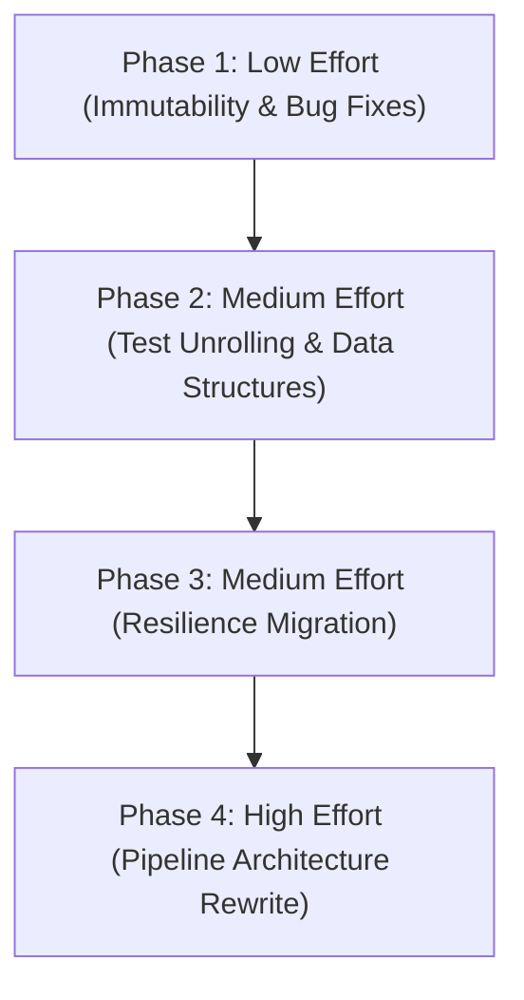

# Modernization & Modularization Plan

## Phased Execution Strategy

We have divided the refactoring into four distinct phases based on effort and risk, culminating in the highest-effort architectural rewrites.

## Phase 1 — Low Effort (Immutability & Bug Fixes)
> **Goal:** Address all quick-wins identified across the domains. Safe, isolated changes.
- **Services:** `ApplicationService` Immutability Update (return `IReadOnlyList<Mod>`), `ModMatchingService` Consolidate Matching Logic.
- **Models:** Add `sealed` to `CheckModsJsonSerializerContext`, Cache Statics in `IgnoredUpdateOptions`, make `PendingConfirmation` an immutable record.
- **Infrastructure:** Fix JSON Options bug in `IgnoreReportUrl`, Consolidate Assembly reflection in `ServiceCollectionExtensions`, harden `SuffixesToRemove` in `ModNameNormalizer`.
- **Tests:** Normalize Project Structure (relocate fakes/fixtures), Strict Naming Rules.

## Phase 2 — Medium Effort (Data Structures & Test Unrolling)
> **Goal:** Address structural inconsistencies in models and strictly enforce `AGENTS.md` testing rules.
- **Models:** Unify DTOs (`SptVersionResponse`), update `DependencyChange` collections to `IReadOnlyList`, pre-compute `MisplacedModReport` expensive getters.
- **Tests:** Unroll all `[Theory]` methods into `[Fact]`, consolidate Entity Factories (`ModFixture`), backfill missing coverage.
- **Services:** Simplify `ModReconciliationService` reconciliation loop with LINQ.

## Phase 3 — Medium Effort (Resilience Migration)
> **Goal:** Drop custom `RateLimitService` in favor of standard .NET native HTTP resilience.
> 
> **Why do this?** Polling and semaphores in custom rate limiters are notorious for introducing hard-to-reproduce thread-starvation or deadlock bugs. The native .NET `Microsoft.Extensions.Http.Resilience` package uses highly optimized, battle-tested Polly v8 engines. It ensures we don't accidentally DDOS an upstream service or lock our own threads.
> 
> **Is it easy / what is the blast radius?** Yes, it is very easy. The change is isolated purely to `Program.cs` / DI registration (adding `.AddStandardResilienceHandler()` to our `HttpClient`) and deleting the `RateLimitService.cs` class. The blast radius is completely contained to the HTTP pipeline; no business logic is affected. Standard Serilog logging will automatically capture retry attempts, so no custom telemetry migration is necessary.

## Phase 4 — High Effort (Pipeline Architecture & Domain Separation)
> **Goal:** Dismantle God objects and split large domain files.
- **Models:** Split `ApiResponses.cs` into isolated file-scoped records (`ModSearchResponses.cs`, etc).
- **Services:** Dismantle the 14-dependency God object `ApplicationService` into a Pipeline or MediatR pattern for each workflow phase (e.g., `IWorkflowStep<WorkflowContext>`).
